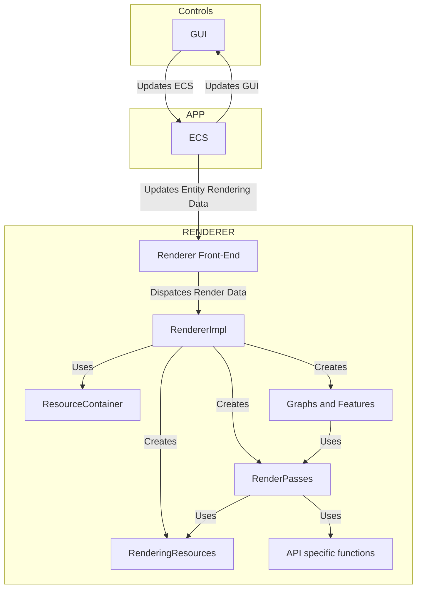

# Graphics Sandbox

## Summary

UI and input driven sandbox for building modular 3D scenes with most commonly known rendering features, which can be build and customised from render graph.

# Development philosophy

The following principles drive the application development.

**Resilience** - Application is resilient to changes, and when issues occur upon changes they are known before runtime.

**Reliability** - Application does what it’s supposed to do, and this can be validated before runtime. 

**Constraints** - Application is planned to handle *only* the amount of data needed to get the job done. The limits must be know and reasoned about.

**Prioritization** **- If and when there are conflicts in features or requirements the ones higher in priority trump the lower.

# Usage and Requirements

### The sandbox should support building the following scenes

1. Scene with lighting and boxes
    1. Used for visualising math operations such as rotations, scaling and translations.
    2. Contains only the most rudimentary rendering effects.
2. Scene with any objects and a larger surface
    1. Used for testing shadows
3. Material scene with spheres
    1. Spheres with materials 
4. Scene with terrain, foliage, water, daytime and fireflies
5. Snowy scene with dynamic footprints.

### The sandbox should support the following rendering features

1. Bump maps, Height maps, Parallax maps, Roughness maps
2. Reflections, Refractions, Bloom, Emission
3. Metals, dielectrics
4. Global illumination
5. lighting model should be BRDF (Cook-Torrance-GGX)
    1. PBR - [https://learnopengl.com/PBR/Theory](https://learnopengl.com/PBR/Theory)
    2. [http://www.codinglabs.net/article_physically_based_rendering_cook_torrance.aspx](http://www.codinglabs.net/article_physically_based_rendering_cook_torrance.aspx)
    3. [https://graphicscompendium.com/theory/08-cook-torrance-ggx](https://graphicscompendium.com/theory/08-cook-torrance-ggx)
6. Shadow maps
7. Volumetric effects
8. Light sources: directional, spot, point  
9. Skyboxes
10. Daytime effects
11. Environmental effects: wind, snow rain 
12. Full screen effects: blur, inversion, downscaling
13. Anti aliasing - FXAA, TAA
14. White noise, Perlin noise
15. Particle effects

### The sandbox UI should support the following use cases

1. Add entities to the scene
2. Add functionality to the entities
    1. Fuctionality is represented by component
3. Modify render features in render graphs
4. Move around the scene with camera using WASD
5. Adjust global rendering settings
6. UI and cursor can be hidden / revealed  
7. Remove entities
8. Remove components from entities..
9. Save constructed scenes as Json.
10. Load previously constructed scenes from Json (deserialization).
11. Save constructed render graphs and features as Json.
12. Load constructed render graphs and features from Json (deserialization).

# Technical Decisions

Decisions that can be made from the development philosophy, use cases, scene and rendering requirements.

## General

- `glm` is used as a math library.
- `assimp` is used for mesh loading.
- `stbi` is used for texture loading.
- Multithreading is supported. An simple example of threading could be:
    - main thread - input, camera, systems
    - worker 1 - particles and fluid update
    - worker 2 - rendering
    - worker 3 - asset loading
    - worker 4 - ui
- `ImGui` is used as UI
- `Tracy` is used for profiling
- `nlohmann` is used for (de)serializations

## Entity Component System

### World

ECS is build around `World`, which contains entities and `Components`. Entities are not containers but indices, and are represented by `id::EntityId`. World contains containers, preferably arrays, which connect components to entities. `World` also provides all functions to retrieve components for entities. Components can be fetched as component - id pair, as array of components or filtered with predicates. 

### Components

`Components` are data, without any necessary functionality. For convenience, some data may be provided with help of helper functions, but components should not contain any functions that has side-effects. All `Components` have a static variable, `::componentId`, which is `uint32_t` or convertible to one. This id is used as a key or index in data structures in `World`. Example of a component is `Transform`. In the following, code block `Transform` is used as an example, how to set up components. 

```cpp
#include <concepts>

// ComponentBase.h
struct ComponentBase {}; // used as a tag in World

// Components.h
template<unsigned COMPONENT_ID>
struct Component 
{
	static constexpr unsigned componentId = COMPONENT_ID;
};

static constexpr unsigned TRANSFORM_ID = 0;
struct Transform : public Component<TRANSFORM_ID>
{
	// impl	
};

// World.h
template<typename T>
concept IsComponent = requires(T t)
{
	{ T::componentId } -> std::same_as<unsigned>;
};

struct World
{
	// lookups here
	template<IsComponent T>
	inline T& get(id::EntityId id){}

	template<IsComponent T>
	inline void add(id::EntityId id, T t){}

	template<IsComponent T, IsComponent ...U>
	inline void add(id::EntityId id, T t, U... u){}

	template<IsComponent T>
	inline void spawn(id::EntityId id, T t){}

	template<IsComponent T, IsComponent ...U>
	inline void spawn(id::EntityId id, T t, U... u){}

	// etc.
};
```

### Systems

All component modification should be performed in `Systems`. All, systems implement the following functionality:

```cpp
class System
{
	public:
		void update(World& world, float deltaTime);
}
```

As systems should not contain any extensive data, it might be more convenient to implement them using runtime polymorphism, and update all systems on a list. The last system on the list is `Renderer`, which represents Renderer front-end. 

### Priorities

It’s not worth overthinking systems, as the point here is not to build a fully fledged game engine. Component count is also probably going to be fairly small, as complex player - player character - world - interactions are not needed. As entity count increases when scenes are constructed, it should become more clear what the scale of the system is, but the most likely object count is going to be some hundreds, and triangle count will most likely not reach over 100k, per scene. Profiler helps here. Initial implementation of the data structures should be 

1. `std::arrays`  

2. `std::unordered_sets` and `std::unordered_maps`. 

The latter can be selectively replaced if processing the data becomes too cumbersome. However, the unordered containers should not be replaced with optimized, more specialized custom data structures, until measured.

Usage of C++20 functionality is advised, as it `<concepts>` are really handy way to achieve compile-time polymorphism, and compile time predicates with it.    

### Some supported Components

1. Mesh - mesh
2. Materials 
    1. Shader and its arguments
    2. Render queue
3. Transform
4. Spring - for foliage
5. FollowsPath - Object traverses in user defined path
6. BrownianMotion - Object traverses in random motion
7. ParticleEmitter

## Renderer

Renderer implementation 

### Supported APIs

- OpenGL

[https://www.opengl.org/Documentation/Documentation.html](https://www.opengl.org/Documentation/Documentation.html)

- Vulkan

[https://devdocs.io/vulkan/](https://devdocs.io/vulkan/)

[https://registry.khronos.org/vulkan/](https://registry.khronos.org/vulkan/)

- DirectX11

[https://learn.microsoft.com/en-us/windows/win32/direct3d11/atoc-dx-graphics-direct3d-11](https://learn.microsoft.com/en-us/windows/win32/direct3d11/atoc-dx-graphics-direct3d-11)

- DirectX12

[https://learn.microsoft.com/en-us/windows/win32/direct3d12/directx-12-programming-guide](https://learn.microsoft.com/en-us/windows/win32/direct3d12/directx-12-programming-guide)

All APIs use same front end and shared implementations. 

The specialization occurs in `RendererImpl` , and in API specific functions and `RenderPasses`. Example of API specific implementation is `glClear`, `ID3D11DeviceContext::ClearRenderTargetView` or `vkCmdClearColorImage`.

`ResourceContainer` includes reference information between asset names and API agnostic `Handles`

`RenderGraph` is an acyclic, unidirectional graph, where edges are the input and output arguments, or `RenderResources` and nodes are the `RenderPasses`. 



## Constraints

The more complex APIs set the constraints for the Renderer architecture, as they have to share common denominator.

Here, some important topics in Vulkan and DirectX12 are required.

### Vulkan

In Vulkan, … 

### Priorities

Variations in different implementations are expected, and the implementation has higher priority than code sharing.  

It’s of utmost importance to understand the high level functionality of Vulkan and DX12 before proceeding.

## Shaders

For OpenGL and Vulkan, SPIR-V shaders and compilation should be used. `glslang` with `glslangValidator` will create reusable shaders across these two APIs. For DirectX11 and DirectX12 use `<D3DCompiler.h>` .

### Priorities

Although, there’re [ways](https://github.com/KhronosGroup/Vulkan-Guide/blob/main/chapters/hlsl.adoc) to use HLSL with Vulkan and OpenGL, the priority is to get the features working. The cross-compilation will be revised once two APIs have been implemented. 

It is also acceptable to have differences in the use cases between APIs, if this otherwise means that some features can’t be implemented or requires using implementations that are violating the best practices with the APIs. 

## Queues, Pass, Graphs, Features

### Queues

- Opaque - depth testing
- Skybox - depth disabled
- Transparent - blending, depth testing and color clear disabled

// list of some passes, API etc.

### Graphs

### Passes

Passes have priorities. This is done in order to avoid excessive runtime polymorphism and use GfxContext to query correct entities and all the necessary context the pass needs to be executed.

### Dependencies and Data Flow

- Queues contain Graphs.
- Graphs contain Passes.
- Passes contain only the data and context needed to perform the pass logic for rendering.
- Essentially the entire render graph is a huge graph of passes. Graphs and Queues are a way to categorize them.

Option 1: CRTP

```cpp
#include <concepts>

struct PassResources{};
struct Gfx{};

using PassIndex = unsigned;

// Option 1: CRTP

class IRenderPass
{
public:
	virtual IRenderPass() = default;
	virtual void execute(PassResources r, Gfx& ctx, GfxDevice* device) = 0;
};

template<typename T>
class RenderPass : public IRenderPass
{
private:
		PassIndex passIndex;
		
public:
		void execute(PassResources r, Gfx& ctx, GfxDevice* device)
		{
				(T*)(this)->execute(r, ctx, device);		
		}
};

class ClearPass : public RenderPass<ClearPass>
{
public:
		void execute(PassResources r, Gfx& ctx, GfxDevice* device)
		{
				_device->clear(r.targetFrambeBuffer, r.clearFlags);
		}
};

// passes
IRenderPass resolvePass(std::string s)
{
		if (s == "clearPass")
		{
				return ClearPass{};
		}
}

std::vector<IRenderPass> buildPasses(auto passData)
(
		std::vector<IRenderPass> passes;
		for(auto d : passData)
		{
				passes.push_back(resolvePass(d.name));
		}
}

```

Option 2: Type erasure

```cpp
#include <concepts>

struct PassResources{};
struct Gfx{};

template<typename T>
concept TRenderPass = requires(T t, PassResources r, Gfx& ctx, GfxDevice* device)
{
		{ t.execute(r, ctx, device) } -> std::convertible_to<void>;
};

class RenderPass
{
public:
		template<TRenderPass T>
		RenderPass(T t) : impl(std::make_unique<Model<T>>(std::move(t))) {}
		
		void execute(PassResources r, Gfx& ctx, GfxDevice* device)
		{
				impl->execute(r, ctx, device);
		}

private:
		std::unique<Content> impl;

		struct Content
    {
				virtual void execute(PassResources r, Gfx& ctx, GfxDevice* device):
    };

		template<TRenderPass T>
		struct Model : public Content
		{
				Model(T t) : t(std::move(t)){}

				void execute(PassResources r, Gfx& ctx, GfxDevice* device) override
				{
						t.execute(r, ctx, device);
				}
				T t;
		};
};

class ClearPass
{
public:
		void execute(PassResources r, Gfx& ctx, GfxDevice* device)
		{
				_device->clear(r.targetFrambeBuffer, r.clearFlags);
		}
};

// passes
RenderPass resolvePass(std::string s)
{
		if (s == "clearPass")
		{
				return RenderPass(ClearPass{});
		}
}

using PassesAndIndices = std::tuple<std::vector<RenderPass>, std::vector<int>>;
PassesAndIndices buildPasses(auto passData)
(
		std::vector<RenderPass> passes;
		std::vector<int> indices;
		for(auto d : passData)
		{
				RenderPass pass = resolvePass(d.name);
				passes.push_back(pass);
				indices.push_back(d.index);
		}
		return std::make_tuple(passes, indices);
}

```

RenderQueue - floaw

```cpp

class RenderQueue
{
public:
		void execute(FrameData data, Gfx& ctx, Device* device) const
		{
				for(auto& graph : graphs)
				{
						graph.execute(ctx, ctx. device);
				}
		}

private:
		std::vector<RenderGraph> graphs;
};

class RenderGraph
{
public:
		void execute(FrameData data, Gfx& ctx, Device* device) const
		{
				for (auto& [index, pass] : passses)
				{
						PassResources r = data.get(index);
						auto output = pass.execute(r, ctx. device);
				}
		}

private:
		std::unordered_map<int, RenderPass> passes;
};

/// USAGE
// build queue
RenderQueue opaque = RenderQueueBuilder::Create(Queue::Opaque); // load OR use cached.
RenderQueue skybox = RenderQueueBuilder::Create(Queue::Skybox);
RenderQueue transparent = RenderQueueBuilder::Create(Queue::Transparent);

//...
auto result = opaque.execute();
```

## Content Pipeline

### Stored Data

- All scenes
- Materials
- Meshes
- Textures
- Shaders
- Models
- Render Graphs
- Render Pass and Feature list
- Render Resources
- Settings - contains folder locations, rendering settings, start scenes etc.

### Serialization

- Objects are constructed from prefabs. These jsons contain references data to the object and their scene transform data.
- All scenes are stored as jsons, which contains the actual implementations of the objects. As I’m not entirely sure if it would help to have references to the prefabs or just plain object data, I’ll go with plain object data for now.

While there are existing solutions that fulfil some general requirements such as, using `assimp` loader to construct objects or full scenes from obj+mtl, with help of texture parsers, the solution inspired by [article](https://medium.com/@heinapurola/engine-internals-content-pipeline-1af34a117f1) series written by Timo Heinäpurola, to use asset manifests, which are essentially jsons. The manifest data is deserialized, for which the `nlohmann` provides a good support, then use an `assimp` to load the meshes, and `stbi` to load the textures, and parse the component data separately. This requires a bit of code work, to create robust custom solution for ensuring proper behaviour, reliability and valid data, but makes data human readable, and easier to present in the UI.

The intended behaviour is that if a reference to a resource is not found, the application runs, but logs error for missing assets, and replaces the missing assets with invalid mesh and material.

```json
// model
{
	"name" : "test_cube_tiled",
	"mesh" : "data/meshes/cube.obj",
	"material" : "data/materials/lit_tiled.json",
	"materialOverride" : {
		"name" : "lit_tiled",
		"shaderName" : "lambertian",
		"textures" : ["data/textures/bricks_diffuse.png", "data/textures/bricks_specular.png"],
		"textureTypes" : ["DIFFUSE", "SPECULAR"],
		"meshColour" : [1, 0, 1, 0],
		"renderQueue" : "Opaque" 
		},
}

// material
{
		"name" : "lit_tiled",
		"shaderName" : "lambertian",
		"textures" : ["data/textures/tiled_diffuse.png", "data/textures/tiled_specular.png"],
		"textureTypes" : ["DIFFUSE", "SPECULAR"],
		"meshColour" : [1, 1, 1, 1],
		"renderQueue" : "Opaque",
}

// scene (option 1)
{
	{
		"name" : "cube_1",
		"mesh" : "data/meshes/cube.obj",
		"materialBase" : "data/materials/lit_tiled.json",
		"material" : {
			"name" : "lit_tiled",
			"shaderName" : "lambertian",
			"textures" : ["data/textures/tiled_diffuse.png", "data/textures/tiled_specular.png"],
			"textureTypes" : ["DIFFUSE", "SPECULAR"],
			"meshColour" : [1, 1, 1, 1],
			"renderQueue" : "Opaque" 
			},
		"transform" : {
			"position" : [-1,0,3],
			"scale" : [1,1,1],
			"rotation" : [0,1,0,1],
	},
	{
		"name" : "cube_2",
		"mesh" : "data/meshes/cube.obj",
		"material" : "data/materials/lit_tiled.json",
		"transform" : {
			"position" : [1,0,3],
			"scale" : [1,1,1],
			"rotation" : [0,1,0,1],
	},
	{
		"name" : "cube_3",
		"mesh" : "data/meshes/cube.obj",
		"material" : "data/materials/lit_tiled.json",
		"transform" : {
			"position" : [1,1,3],
			"scale" : [1,1,1],
			"rotation" : [0,1,0,1],
	},
}

// scene (option 2)
{
	{
		"name" : "cube_1",
		"model" : "test_cube_tiled",
		"material" : "data/materials/lit_tiled.json",
		"transform" : {
			"position" : [-1,0,3],
			"scale" : [1,1,1],
			"rotation" : [0,1,0,1],
	},
	{
		"name" : "cube_2",
		"model" : "test_cube_tiled",
		"material" : "data/materials/lit_tiled.json",
		"transform" : {
			"position" : [1,0,3],
			"scale" : [1,1,1],
			"rotation" : [0,1,0,1],
	},
	{
	"name" : "cube_3",
	"model" : "test_cube_tiled",
	"material" : "data/materials/lit_tiled.json",
	"transform" : {
		"position" : [1,1,3],
		"scale" : [1,1,1],
		"rotation" : [0,1,0,1],
	},
}
```

The application uses a ResourceSystem for loading and storing meshes, textures, materials etc, and returns a Handle to those resources, The resources must be data directly usable by the renderer to pass them to the GPU, and to provide handles, based on keys, to ecs. These keys are stored in jsons. The reference data (file paths etc) are used for all data that is likely to not change much from object to object. Not having all the information directly embedded in the object results in the necessity to add override data, which again means, the 

Since this data is used to construct the component data 

## Architecture, Dataflow and APIs

All data that doesn’t need to change is uploaded once and rendered on each frame.

**Additional docs and literature to support the design decisions**
Graphs - rendering effects build from passes

[https://docs.google.com/drawings/d/1Nur78MQGyrQfeGWufy9-zEmsufW7mQp8orvo7F7aCac/edit](https://docs.google.com/drawings/d/1Nur78MQGyrQfeGWufy9-zEmsufW7mQp8orvo7F7aCac/edit)- Vulkan architecture is a good inspiration for this. Use the same in OpenGL

[https://logins.github.io/graphics/2021/05/31/RenderGraphs.html](https://logins.github.io/graphics/2021/05/31/RenderGraphs.html)

[https://andrewcjp.wordpress.com/2019/09/28/the-render-graph-architecture/](https://andrewcjp.wordpress.com/2019/09/28/the-render-graph-architecture/)

[https://advances.realtimerendering.com/s2017/index.html](https://advances.realtimerendering.com/s2017/index.html)

[https://apoorvaj.io/render-graphs-1/](https://apoorvaj.io/render-graphs-1/)

[https://poniesandlight.co.uk/reflect/island_rendergraph_1/](https://poniesandlight.co.uk/reflect/island_rendergraph_1/)

[https://themaister.net/blog/2017/08/15/render-graphs-and-vulkan-a-deep-dive/](https://themaister.net/blog/2017/08/15/render-graphs-and-vulkan-a-deep-dive/) 

 

## Learnings and thoughts so far

### Containers

For frequent queries `std::map` and `std::unordered_map` are not great. Internally both of these use some kind of a bucket implementation which resembles a linked list. I ended up rolling my own maps: one for content that is mostly accessed by key, but support iteration, and one that doesn’t support iteration. Former being called `LinearMap`, and latter `SparseMap`, representing array of pairs, and array of keys in respective indices. This solves the initial problem with slow data access, but memory fragmentation is significant. In order to reduce this a bucketing implementation or two sets of arrays, representing keys and values, are preferred.

### Shaders

Requirements for shaders are to:

- Support all APIs. > Single implementation
- View shader data layout and their types and values on UI.
- Runtime efficiency, and modularity

The flow could be:

1. Implement shader
2. Add a shader to mesh using the UI.
3. Configure shader arguments (constant buffers, textures etc.) on UI.
4. Data is then passed via UI > EditorManager > ECS > Renderer > Worker > Device   

Not all the shader arguments are or should be configurable i.e. Model Matrix.

Permutations:

- For example, for most shader programs vertex shaders are identical.

### Implementation and Compilation

In order to add new shaders for each API effectively, shaders should be written only once. The challenge here is that OpenGL and Vulkan use GLSL as their main shading language, whereas for DX11 and DX12, the main shading language is HLSL. For modern APIs, the obvious choice for implementations would be SPIR-V, but DX11, or the compiler, fxc, DX11 uses for shader compilation, SPIR-V is not really supported. There are couple of alternative approaches:

1. Annotations and Metadata - Use macros to specify which shader arguments which should be exposed to UI. The same approach could be used to gather metadata from shaders about the names and types of the buffers ( uniforms ).
2. “Reflection” - All used APIs support querying information about active shaders. For this, a separate implementation is needed. Alternatively, this could be run on runtime, when the main application starts, when ever new shaders are added, or existing ones change.
3. Largest common nominator - that is code generation. Most likely all the shader functionality of supported by the APIs are not needed anyway. If the subset of features is limited enough, it might be worth it to create an intermediate implementation, which then generates the shaders.    

### Data layout - Runtime

On runtime, the correct data layout and the corresponding values should work without alternative code additions / shader or data. What does the data look like?

```cpp
enum class ArgType
{
		Int32,
		Float,
		Float2,
		Float3,
		Float4,
		Mat2x2,
		Mat3x3,
		Mat4x4,
		Texture2D,
		ConstBuffer,
};

union ArgValue
{
		int intValue;
		float floatValue;
		float float2Value[2];
		float float3Value[3];
		float float4Value[4];
		float mat2x2Value[4];
		float mat3x3Value[9];
		float mat4x4Value[16];
		id::Texture2D_Id texture2dId;
		BufferHandle bufferHandle;
};

struct MetaData
{
		int bindPosition;
		int bufferUsage;
		size_t size;
};

struct ShaderArgs
{
		std::array<ArgType, 10> types;
		std::array<ArgValue, 10> values;
		std::array<MetaData, 10> metaData;
};

struct ShaderResourceBinding 
{
		size_t argCount = 0;
		ShaderArgs args{};
};

struct GLShaderMetaData
{
		std::string shaderName{};
		const std::string& argName(size_t index)
		{
				return _argNames[index];
		}
		std::array<std::string, 10> _argNames;
};
//

LinearMap<id::ShaderId, ShaderProgram> shaders;
LinearMap<id::ShaderId, GLShaderMetaData> shaderMetaData{};
id::ShaderId activeShader = id::InvalidShaderId;

void GfxDeviceOpenGL:bindShader(id::ShaderId shaderId, const ShaderResourceBinding& bindings) 
{
		ShaderProgram& shader = shaders[shaderId];
		const GLShaderMetaData &shaderMeta = shaderMetaData[shaderId];
		
		const ShaderArgs &args = bindings.args;
		const size_t size = bindings.argCount;

		for (size_t i = 0; i < size; ++i)
		{
				const auto& type = args.types[i];
				const auto& value = args.values[i];
				const auto& name = shaderMeta.argName(i);

				if (type == ArgType.Float)
					shader.setFloat(name, value.floatValue);
				if (type == ArgType.Float2)
					shader.setFloat2(name, value.float2Value);
				...
				if (type == ArgType::Texture2D)
				{
						const auto& meta = args.metaData[i];
						bindTextureImpl(name, value.texture2dId, meta.bindPosition);
				}
				if (type == ArgType::ConstBuffer)
				{
						const auto& meta = args.metaData[i];
						bindConstBufferImpl(name, value.bufferHandle, meta.bindPosition, meta.size, meta.bufferUsage); 
				}
		}
}
```

### Data layout - UI

## Rendering use cases

Essentially all rendering use cases can be formed as a composition of atomic operations.